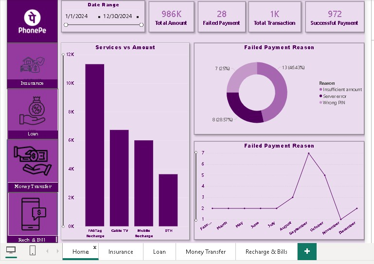
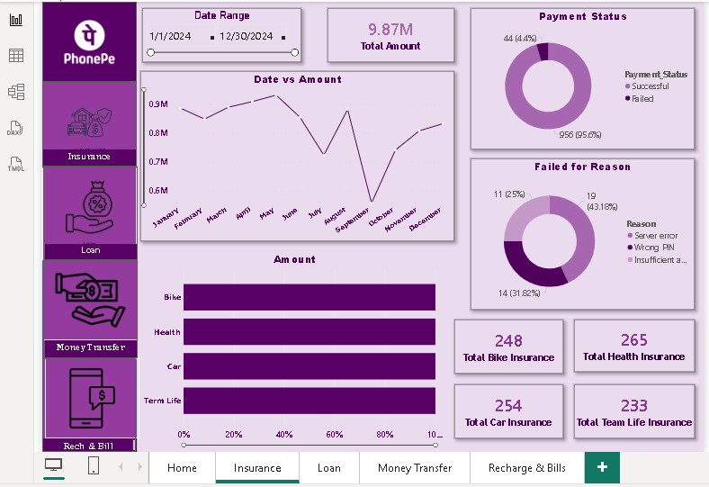
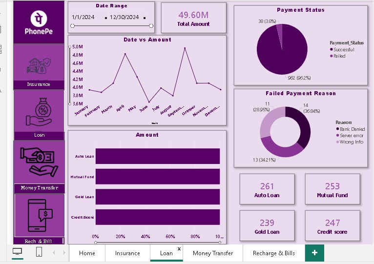
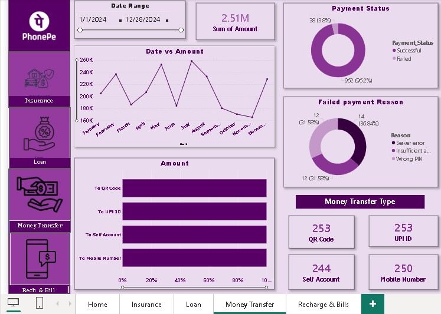
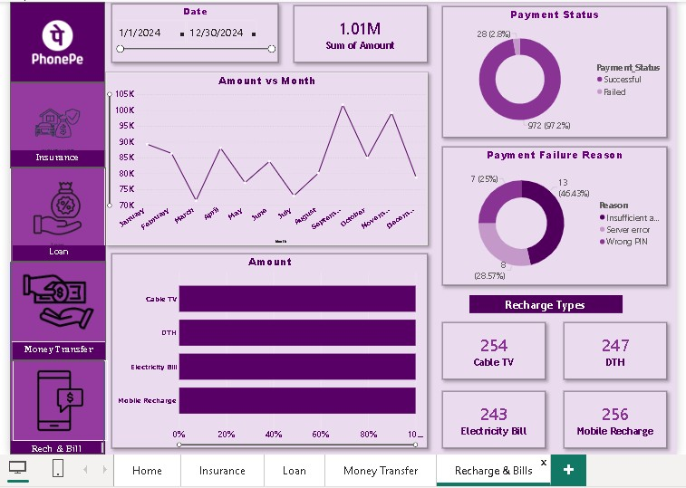

**📱 PhonePe Payment Dashboard**

The PhonePe Payment Dashboard provides a detailed overview of transaction performance, failed payments, service usage, and payment trends.
This dashboard helps analyze digital payment activities and identify major reasons behind transaction failures.

**📊 Dashboard Highlights**

It has 5 slides

**1. Home

2. Insurance

3. Loan

4. Money Transfer

5. Recharge and Bills**

**1️⃣ Home**

**2️⃣ Insurance**

**3️⃣ Loan**

**4️⃣ Money Transfer**
 

**5️⃣ Recharge and Bills**

**🎯 Purpose of the Dashboard**

This dashboard helps:
Monitor digital payment performance
Analyze transaction success rates
Track failed payment patterns
Improve service reliability
Support financial reporting and operational decisions

**✨ Features**

Interactive date range filter
Service-wise transaction analysis
Failed payment breakdown visualization
Monthly payment trend analysis
User-friendly dashboard layout

**📌 Business Outcome**

Using this dashboard, businesses can:

Improve payment success rates
Detect common transaction issues
Optimize digital payment services
Enhance customer payment experience
Reduce payment failure frequency
